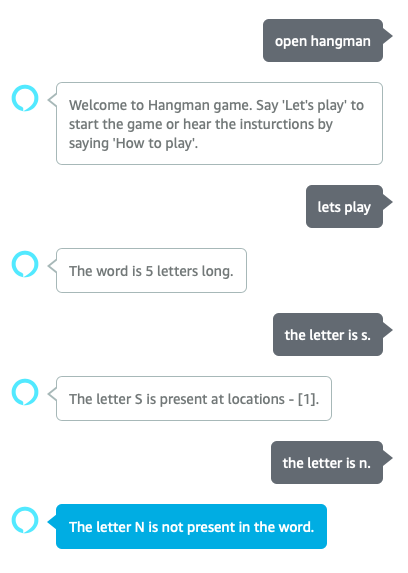

# Hangman - Alexa Skill
An Alexa skill which allows you to play Hangman with your device.

## Invocation
The skill is currently named as hangman and is invoked by saying the same. The user says **"Let's play"** to which the skill responds with the number of characters in the word. On a correct guess of a letter, the device mentions the position of the paricular letter in the word. The game ends when the user has guessed all the letters.

## Sample interaction

 

### TODO
1. Allow the user to guess the word directly without guessing all the letters.
2. Add a concise 'How to play' instructions to the skill.
3. Add a UI element to the game with the accompanying Alexa cards for the mobile application.
4. Polish out the Voice UI for better flow of the game when playing.
